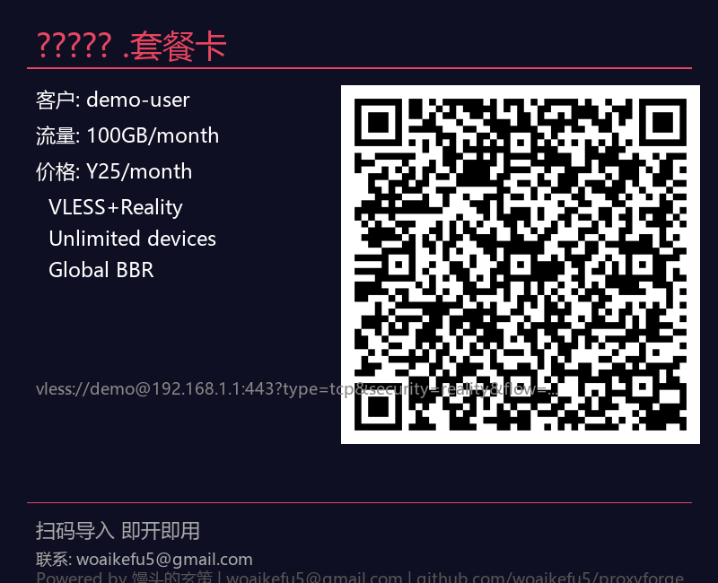

<p align="center">
  [](https://github.com/woaikefu5/proxyforge/actions)

  <h1> 馒头的玄策</h1>
  <p><b>Xray 多协议管理 + 套餐卡一键生成</b></p>
    [](https://github.com/woaikefu5/proxyforge/actions)
  <p><code>Python 3.9+</code> · <code>Win / Mac / Linux</code> · <code>MIT</code> · <code>v1.2.1</code></p>
</p>

---

## 这是什么？

**馒头的玄策** — 给节点主用的工具箱。

> 添加服务器  配置协议  生成带二维码的客户套餐卡，三步搞定。



---

##  快速开始

```bash
git clone https://github.com/woaikefu5/proxyforge.git
cd proxyforge
pip install -r requirements.txt
python -m proxyforge.main
```

>   **[详细中文教程  点这里](GUIDE.md)** / **[从零开始保姆级教程](TUTORIAL.md)**


##  运行环境

>   **极低门槛**：1核CPU + 1GB内存的 VPS 即可流畅运行。Xray 核心 + 玄策管理系统内存占用不到 200MB。

---
---

##  功能

| 模块 | 说明 |
|------|------|
|  多协议 | VLESS+Reality / WS+TLS / gRPC / VMess / Trojan / Shadowsocks |
|  Xray 下载 | 内置 Xray-core 自动下载，无需手动装 |
|  套餐卡 | 一键生成带二维码的客户卡 (PNG) |
|  多节点 | 管理多个 VPS，每个多入站 |
|  跨平台 | Win / Mac / Linux |

---

##  支持的协议

| 协议 | 传输 | 安全 | 推荐 |
|------|------|------|------|
| VLESS | TCP | Reality+Vision |   首选 |
| VLESS | WebSocket | TLS | CDN |
| VLESS | gRPC | TLS | 高性能 |
| VMess | WebSocket | TLS | 兼容 |
| Trojan | TCP | TLS | 轻量 |
| Shadowsocks | TCP | AEAD | 极简 |

---

##  使用流程

```
 1  添加服务器      输入 VPS IP
 2  添加入站协议    选协议  填参数
 3  生成套餐卡      客户名 + 套餐  出图到桌面！
```

---

##  项目结构

```
proxyforge/
  main.py           CLI 菜单
  config.py         配置管理
  protocols.py      6 协议链接生成
  cardgen.py        套餐卡 + 二维码
  xray.py           Xray 下载器
  assets/           展示图
  GUIDE.md          详细中文教程
```

---

##  免责声明

仅供学习和技术交流。请遵守当地法律法规。

---

##  捐赠 / 打赏

如果这个工具帮到了你，可以请我喝杯咖啡  

<p align="center">
  [](https://github.com/woaikefu5/proxyforge/actions)

  
</p>

---

##  更新日志

[CHANGELOG.md](CHANGELOG.md)

---

##  License

MIT

